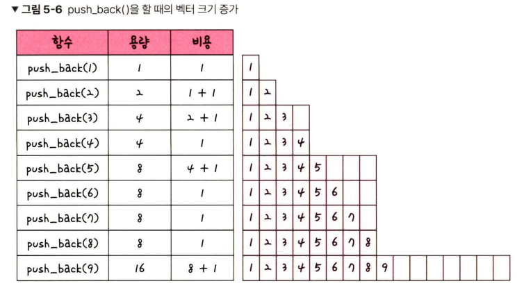

# 5.2 선형 자료 구조(5.2.2 -5.2.5)

## 배열

- 같은 타입의 변수들로 이루어짐
- 크기가 정해져 있음
- 인접한 메모리 위치에 있는 데이터를 모아놓은 집합
- 중복 허용
- 순서
- 접근(참조) O(1), 삽입/삭제 O(n)
- 데이터 추가, 삭제가 많은 경우 → 연결 리스트
- 접근(참조)를 많이 하는 경우 → 배열

### 랜덤 접근과 순차적 접근

- 랜덤 접근(직접 접근): 동일한 시간에 배열과 같은 순차적인 데이터가 있을 때 임의의 인덱스에 해당하는 데이터에 접근할 수 있는 기능
- 순차적 접근: 데이터를 저장된 순서대로 접근
- 랜덤 접근 ↔ 순차적 접근

### 배열과 연결 리스트 비교

- 배열 - 상자를 순서대로 나열한 데이터 구조, 몇 번째인지만 알면 해당 상자의 요소에 접근 가능
- 연결 리스트 - 상자를 선으로 연결한 형태의 데이터 구조, 상자 안의 요소에 접근하려면 하나씩 확인해 봐야 함

- n번째 요소의 접근(참조)
    - 배열: 빠름 - O(1)
    - 연결 리스트: 느림 - O(n)

→ 참조가 많이 일어나는 작업의 경우 배열은 빠르고 연결 리스트는 느리다

- 데이터 추가 및 삭제
    - 배열: 느림 - 모든 상자를 앞으로 옮겨야 추가할 수 있음
    - 연결: 빠름 - 선을 바꿔서 연결해 주기만 하면 됨

### 벡터

- 동적으로 요소를 할당할 수 있는 정적 배열
- 컴파일 시점에 개수를 모른다면 벡터를 써야 함
- 중복 허용
- 순서
- 랜덤 접근 가능
- 탐색, 맨 뒤 요소 삽입/삭제 - O(1)
- 맨 뒤가 아닌 요소 삽입/삭제 - O(n)
- 함수 종류
    - `push_back()`  뒤부터 요소 더하기
    - `pop_back()` 맨 뒤부터 지우기
    - `erase()` 지우기
    - `find()` 요소 찾기
    - `clear()` 배열 초기화
- **`push_back()` 의 시간 복잡도가 O(1)인 이유**
    - push_back()을 할 때마다 벡터의 크기가 증가되는 것은 아님
    
    
    
    - 2의 제곱승 + 1마다 백터의 크기가 2배가 됨
    - c_i: push_back()을 할 때 드는 비용
    - c_i = 1 or c_i = 1 + 2^k 이다
    
    
    
    - T(n): n번 push_back()을 한다고 했을 때 드는 비용
    - (3n - 1) /  n ⇒ 3 평균적인 벡터의 크기(비용)
    - 상수이므로 O(1)의 시간 복잡도를 가진다고 할 수 있음

## 스택

- 가장 마지막으로 들어간 데이터가 가장 첫 번째로 나오는 성질(LIFO, Last In First Out)
- 재귀적인 함수, 알고리즘, 웹 브라우저 방문 기록 등에 사용
- 삽입, 삭제 - O(1)
- 탐색 - O(n)

## 큐

- 먼저 집어넣은 데이터가 먼저 나오는 성질(FIFO, FIrst In First Out)
- CPU 작업을 기다리는 프로세스, 스레드 행렬 또는 네트워크 접속을 기다리는 행렬, 너비 우선 탐색, 캐시 등에 사용
- ↔ 스택
- 삽입, 삭제 - O(1)
- 탐색 - O(n)